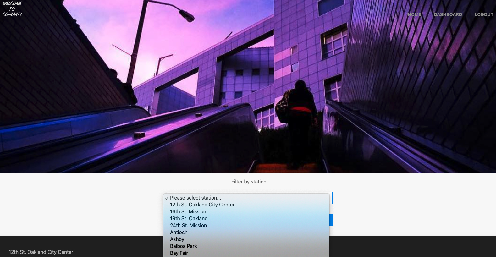

# Co-Bart Community Group
## by Aaron Rosenblatt and Tina Nguyen

#### We combined our work to write CMS-style blog site where Bay Area Rapid Transit (BART) riders can signup, login and submit posts, comments and updates about their experience using the system. There is also room for the BART administration to post updates and announcements in real time. With ridership bound to increase in the next few months, a significant amount of people will ride the system for the first time in a year. The sudden mass of riders is bound to cause a few hiccups in the transit experience. 

#### The site is built completely from scratch following the Model View Controller paradigm in its architectural structure, using Handlebars.js as the template language, Sequelize as the Object–Relational Map, and the Express-Session NPM package for authentication. This app also uses bcrypt, Dotenv and Axios. 

#### When users signup and login to the Co-Bart Community Group they can view posts from other users based on the Bart Station they depart from. Each post contains the station name, the user name, the date created, the message in the post and and opportunity to comment on the post. There is also a dropdown menu consisting of all 50 Bart stations taken from the Bart API where users can filter posts based on the Bart station. A dashboard link allows users to view the posts they created individually, as well as a button where a user can create a post. When a user clicks on a post they will have an opportunity to select the departing and arriving stations based on a dropdown menu from the Bart API, as well as an opportunity to make comments, update a post or delete a post. 

### The Co-Bart Community Group app can be viewed here: http://bort-community.herokuapp.com/dashboard/

### The GitHub repository for Co-Bart Community Group can be viewed here: https://github.com/noplur/Bort-Community

### Here is a screenshot of a sample from Co-Bart Community Group:
### 

